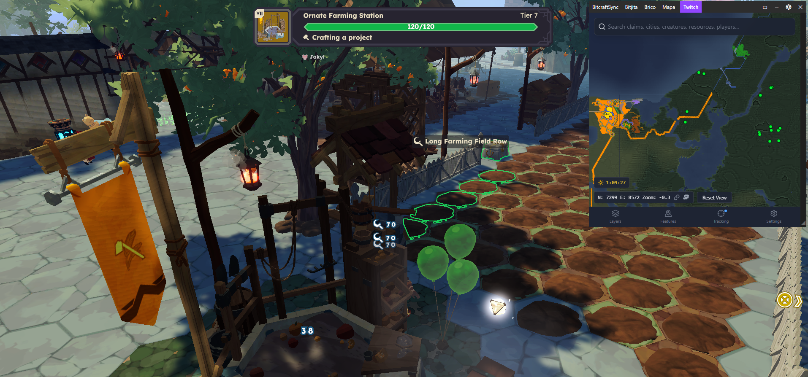
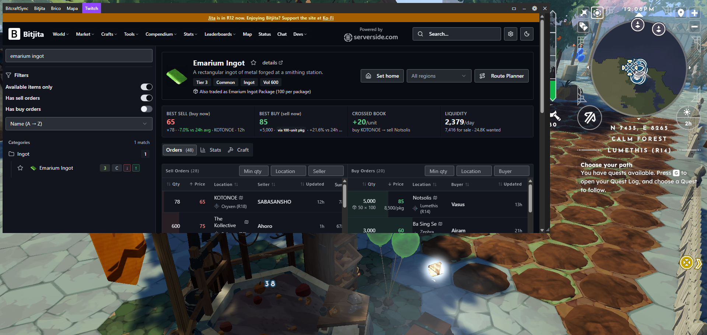
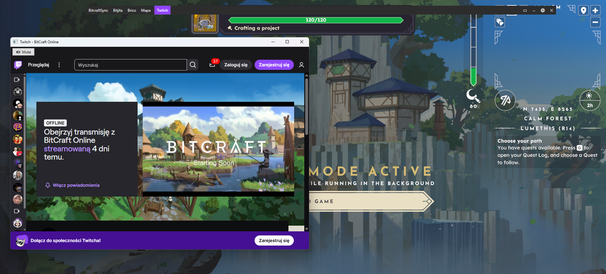
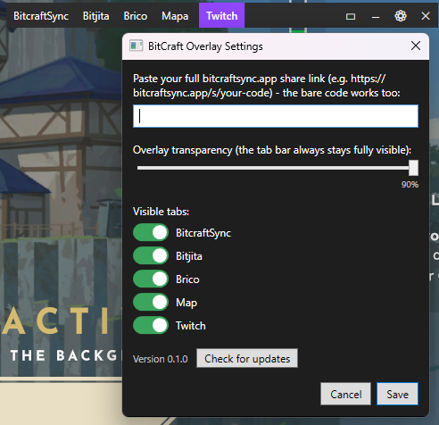

# BitCraft Overlay

[](https://ko-fi.com/Z6O024TDK7)

A floating, always-on-top overlay for [BitCraft Online](https://bitcraftonline.com) that shows everything you need in one place, without leaving the game and without stealing window focus:

- **[bitcraftsync.app](https://bitcraftsync.app)** — your team's share link
- **[bitjita.com](https://bitjita.com)** — market/listings
- **[brico.app](https://brico.app)** — recipe database
- **[bitcraftmap.com](https://bitcraftmap.com)** — map (remembers your last view)
- **Twitch** (`twitch.tv/bitcraftonline`) — separate window for watching the stream / drops

## Screenshots

Map overlay next to gameplay:



Bitjita market lookup:



Twitch popup window:



Settings — per-tab toggles and icon/text display mode:



## Disclaimer

This project is **not affiliated with, endorsed by, or sponsored by Clockwork Labs** (the developer of BitCraft Online) in any way. It's an independent, fan-made community tool.

The source code is fully open and public — for transparency and honesty, so anyone can verify exactly what the app does for themselves. The overlay **does not interfere with the game client in any way**: it doesn't read or modify the game process's memory, doesn't inject any code, doesn't modify game files, and doesn't talk to the game's servers/protocol. It's simply a separate, independent window displaying publicly available websites next to the game — exactly the same as a regular browser open on a second monitor.

## Goal

The main goal is to make the game easier to play for people on a **single monitor** — instead of alt-tabbing to a separate browser (which steals window focus and loads a whole second browser onto weaker hardware), all the community tools you need are available in one lightweight window on top of the game.

## Official BitCraft Online sources

- Game website: https://bitcraftonline.com

## Features

- Draggable bar (tabs + buttons)
- Collapse to just the bar, reset size, resize width/height via the corner grip
- Remembers position, size, and the last URL of each tab
- Option to hide individual tabs, and to show icons instead of text labels, in settings

## Build

Requires the [.NET 8 SDK](https://dotnet.microsoft.com/download) and Windows (WPF + WebView2 Runtime, usually preinstalled on Windows 11).

```bash
cd BitCraftOverlay
dotnet build
dotnet run
```

Or skip building it yourself and grab a ready-to-run build from the [Releases page](https://github.com/NowakAdmin/bitcraft-overlay/releases).

## Status

Hobby project, built for the BitCraft community. Bug reports / ideas welcome via Issues.
